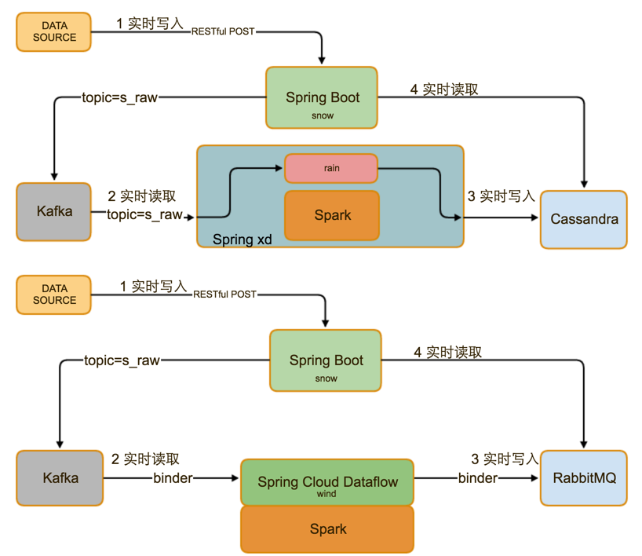
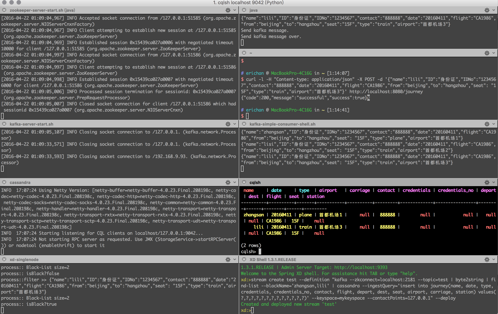
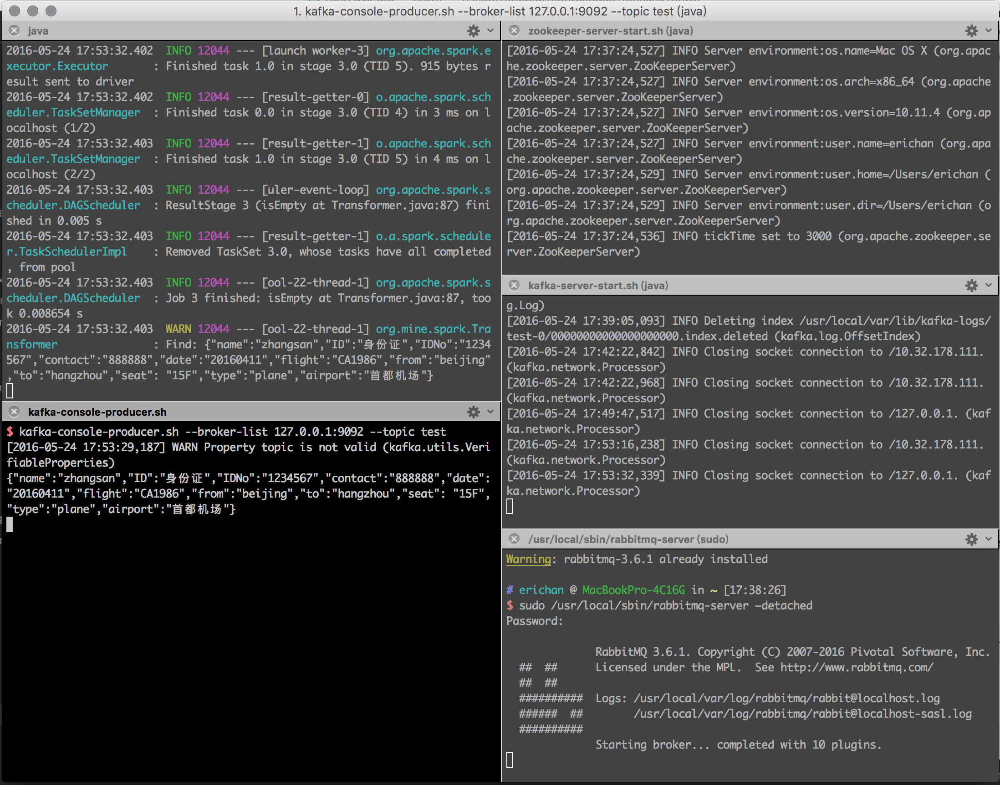

# Flurry
Real time Calculating Platform

[](https://travis-ci.org/feuyeux/flurry)



## 1 module
### snow
A restful service by using spring boot, for receiving and processing real time input, also, for representing data.

### rain
Core real time algorithm for processing data above spring xd.

### wind
Core real time algorithm for processing data by using spring cloud dataflow.

## 2 XD quick start

### 1 Start Services
#### zookeeper
```
zookeeper-server-start.sh /usr/local/Cellar/kafka/0.8.2.2/libexec/config/zookeeper.properties
```
#### kafka
```
kafka-server-start.sh /usr/local/Cellar/kafka/0.8.2.2/libexec/config/server.properties
```
#### cassandra
```
cassandra -f
```
#### spring-xd(include spark lib)
```
xd-singlenode
```

### 2 Start Clients for Spring XD Architecture
#### cassandra
```
cqlsh localhost 9042
```

#### spring-xd
```
xd-shell
```

#### xd moduls
```
bin/build.sh
```
```
xd:>module upload --file /opt/flurry/find-list-processor-1.0-SNAPSHOT.jar --type processor --name find-list
```

```
xd:>module list

```
#### xd stream
```
xd:>stream create test --definition "kafka --zkconnect=localhost:2181 --topic=test --outputType=text/plain | find-list  --blackName='zhangsan,lili' | cassandra --ingestQuery='insert into journey(name, date, type, credentials, credentials_no, contact, flight, depart, dest, seat, airport, carriage, station) values(?,?,?,?,?,?,?,?,?,?,?,?,?)' --keyspace=mykeyspace --contactPoints=127.0.0.1" --deploy

xd:>stream list
```
### 3 rest
```
java -jar /opt/flurry/snow-sprint1-
```

### 4 test
```
curl -l -H "Content-type: application/json" -X POST -d '{"name":"zhangsan","ID":"身份证","IDNo":"1234567","contact":"888888","date":"20160411","flight":"CA1986","from":"beijing","to":"hangzhou","seat": "15F","type":"plane","airport":"首都机场1"}' http://localhost:8080/journey

curl -l -H "Content-type: application/json" -X POST -d '{"name":"lisi","ID":"身份证","IDNo":"1234567","contact":"888888","date":"20160411","flight":"CA1986","from":"beijing","to":"hangzhou","seat": "15F","type":"train","airport":"首都机场2"}' http://localhost:8080/journey

curl -l -H "Content-type: application/json" -X POST -d '{"name":"lili","ID":"身份证","IDNo":"1234567","contact":"888888","date":"20160411","flight":"CA1986","from":"beijing","to":"hangzhou","seat": "15F","type":"train","airport":"首都机场3"}' http://localhost:8080/journey
```

### 5 verify

```
kafka-simple-consumer-shell.sh --broker-list localhost:9092 --topic test --partition 0
```

```
SELECT * FROM mykeyspace.journey;
```

```
curl http://localhost:8080/journey
```

## 3 DataFlow quick start


### 1 Start Services
#### zookeeper
```
zookeeper-server-start.sh /usr/local/Cellar/kafka/0.8.2.2/libexec/config/zookeeper.properties
```
#### kafka
```
kafka-server-start.sh /usr/local/Cellar/kafka/0.8.2.2/libexec/config/server.properties
```
#### rabbitmq
```
sudo /usr/local/sbin/rabbitmq-server –detached
```

### 2 run application
The application receives data streaming from Kafak by Topic Name 'test', and sends data streaming to RabbitMQ.
```
java -jar target/spark-transfer-1.0-SNAPSHOT.jar
```
### 3 test
```
kafka-console-producer.sh --broker-list 127.0.0.1:9092 --topic test '{"name":"zhangsan","ID":"身份证","IDNo":"1234567","contact":"888888","date":"20160411","flight":"CA1986","from":"beijing","to":"hangzhou","seat": "15F","type":"plane","airport":"首都机场"}'
```
### 4 verify
Check exchange in `http://127.0.0.1:15672/#/exchanges`

guest/guest

## [quick start details](doc/demo.md)  
