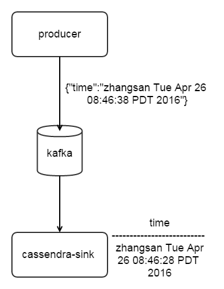

# Spring Cloud Stream
---
## 简介
关于Spring Cloud Stream，有很多类似的子project。它们有何异同？
### Spring XD
Spring XD是早期设计的分布式运行环境，其提供container和shell功能，在shell上通过配置流来实现大数据下的便捷开发。  
目前已将其重新设计为Spring Cloud Data Flow，不过前者的功能和文档都要比后者全很多，例如XD可以自定义并注册各个module。  
Spring XD功能较重，是一个庞大的运行环境，内集成大量lib，包括spark的1.4.1的lib。
### Spring Cloud Data Flow
Data Flow是XD的升级版。也提供container和shell功能，在shell上可以配置流。container和shell是以jar包形式运行
Data Flow的运行模式有多种，对应的github如下。
```
https://github.com/spring-cloud/spring-cloud-dataflow/tree/master/spring-cloud-dataflow-server-local[Local]
https://github.com/spring-cloud/spring-cloud-dataflow-admin-yarn[YARN]
https://github.com/spring-cloud/spring-cloud-dataflow-admin-cloudfoundry[Cloud Foundry]
https://github.com/spring-cloud/spring-cloud-dataflow-admin-mesos[Mesos]
https://github.com/spring-cloud/spring-cloud-dataflow-admin-kubernetes[Kubernetes]
```
以local模式为例,启动Spring Cloud Data Flow运行环境:
```
redis-server
java -jar spring-cloud-dataflow-admin-local-1.0.0.M2.jar
java -jar spring-cloud-dataflow-shell-1.0.0.M2.jar
dataflow:>stream create ticktock --definition "time | log" --deploy
```
Spring Cloud Data Flow的运行**依赖于redis或者kafka**。   
目前版本不支持使用本地jar包注册Data Flow的module，已有bugfix，后面应该会支持。目前Data Flow的shell功能以及手册远没有XD丰富。
### Spring Cloud Stream
Spring Cloud Stream为消息驱动的微服务提供架构，其基于Spring Boot、 Spring Integration、Spring Cloud bus等。
>By adding @EnableBinding to your main application, you get immediate connectivity to a message broker and by adding @StreamListener to a method, you will receive events for stream processing.    

### Spring Cloud Stream modules
这是重点，核心思想是多个微服务直接关联，减少Spring XD或者Spring Cloud Data Flow运行环境部署的复杂度。
Spring Cloud Stream modules使用Spring Cloud Stream架构构建数据消息驱动的微服务。这些微服务通过如下两个重要的信息关联:  
1. binder 微服务间的消息订阅系统，可以是kafka、redis等，这是Data Flow依赖于他们的原因。有数据关联的微服务应使用相同的binder。下面例子中两个微服务使用的binder是kafa。  
2. destination  微服务间的输入输出标记，如果一个微服务的输入是另一个微服务的输出那么他们的destination应相同。下面的列子中两个微服务的destination是ktest。
```
java -jar producer-1.0-SNAPSHOT.jar  --spring.cloud.stream.bindings.output.binder=kafka --spring.cloud.stream.bindings.output.destination=ktest
java -jar cassandra-sink-1.0-SNAPSHOT.jar --spring.cloud.stream.bindings.input.binder=kafka --spring.cloud.stream.bindings.input.destination=ktest --ingestQuery='insert into te(time) values(?)' --keyspace=mykeyspace --contactPoints=127.0.0.1 --server.port=8801
```
kafka作为binder可以指定broker、port等配置，详见http://docs.spring.io/spring-cloud-stream/docs/current-SNAPSHOT/reference/htmlsingle/。
## 实践
  

### Demo1
#### 启动
1. 启动zk、kafka、cassandra
1. 启动Snow，其接收的数据写入到Kafka中，Topic=test。
1. 启动spark-transfer微服务
```
java -jar spark-transfer-1.0-SNAPSHOT.jar
```
1. 启动cassandra-sink
```
java -jar cassandra-sink-1.0-SNAPSHOT.jar --ingestQuery='insert into journey(name, date, type, credentials, credentials_no, contact, flight, depart, dest, seat, airport, carriage, station) values(?,?,?,?,?,?,?,?,?,?,?,?,?)' --keyspace=mykeyspace --contactPoints=127.0.0.1
```
#### 构造输入
可以通过snow构造，也可以通过kafka直接构造，例如
```
bin/kafka-console-producer.sh --broker-list 127.0.0.1:9092 --topic test
{"name":"zhangsan","ID":"身份证","IDNo":"1234567","contact":"888888","date":"20160411","flight":"CA1986","from":"beijing","to":"hangzhou","seat": "15F","type":"plane","airport":"首都机场"}
```
#### 检测
spark-transfer输出
```
 Find: {"name":"zhangsan","ID":"身份证","IDNo":"1234567","contact":"888888","date":"20160411","flight":"CA1986","from":"beijing","to":"hangzhou","seat": "15F","type":"plane","airport":"首都机场"}
```
cassandra-sink输出
```
received: {"name":"zhangsan","ID":"身份证","IDNo":"1234567","contact":"888888","date":"20160411","flight":"CA1986","from":"beijing","to":"hangzhou","seat": "15F","type":"plane","airport":"首都机场"}
```
数据库检测
```
cqlsh:mykeyspace>SELECT * FROM mykeyspace.journey;
 name     | date     | type  | airport  | carriage | contact | credentials | credentials_no | depart | dest | flight | seat | station
----------+----------+-------+----------+----------+---------+-------------+----------------+--------+------+--------+------+---------
 zhangsan | 20160411 | plane | 首都机场 |     null |  888888 |        null |           null |   null | null | CA1986 |  15F |    null
```

### Demo2
专注性能调优，使用producer直接输入。
producer每秒产生一个字符串，通过binder交给kafka。producer和cassandra-sink通过ktest做输入输出的关联。  
#### producer输出
```
{"time":"zhangsan Tue Apr 26 08:48:03 PDT 2016"}
{"time":"zhangsan Tue Apr 26 08:48:04 PDT 2016"}
{"time":"zhangsan Tue Apr 26 08:48:05 PDT 2016"}
```
#### kafka检测
检测命令
```
bin/kafka-simple-consumer-shell.sh --broker-list localhost:9092 --topic ktest --partition 0  
```
观察结果
```
ontentType
          "text/plain"{"time":"zhangsan Tue Apr 26 08:46:18 PDT 2016"}
ontentType
          "text/plain"{"time":"zhangsan Tue Apr 26 08:46:19 PDT 2016"}
ontentType
          "text/plain"{"time":"zhangsan Tue Apr 26 08:46:20 PDT 2016"}
```
#### cassandra检查
检查命令
```
cqlsh:mykeyspace> select * from te;
```
观察结果
```
 time
---------------------------------------
 zhangsan Tue Apr 26 08:46:28 PDT 2016
 zhangsan Tue Apr 26 08:46:43 PDT 2016
 zhangsan Tue Apr 26 08:46:44 PDT 2016
 zhangsan Tue Apr 26 08:46:30 PDT 2016
```
